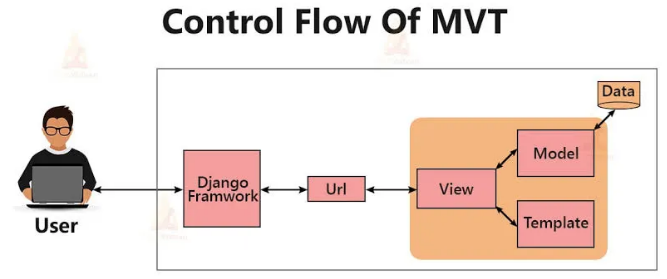

https://ainur-fadhil-footballshop.pbp.cs.ui.ac.id/

# Django Step by Step!
## Setup Projek
Seperti yang telah dipelajari, hal pertama yang dilakukan adalah membuat *virtual environment* lalu mengaktifkannya melalui terminal.
Selanjutnya, sebelum membuat proyek Django, saya menyiapkan requirements yang akan diperlukan terlebih dahulu. Lalu setelah itu baru membuat projek djangonya. Dalam hal ini saya memberikan nama projeknya adalah football_shop.
Selanjutnya saya membuat file .env yang digunakan untuk development lokal dan membuat .env.prod untuk nanti pada saat deployment.
Setelah konfigurasi yang telah saya lakukan di env nya telah berhasil, maka lanjut untuk memanggil *environment variable* tadi di file settings.py.
Selanjutnya pada file yang sama, saya menambahkan juga 3 string pada ALLOWED_HOST, yaitu "localhost", "127.0.0.1", dan yang terakhir adalah link pws saya.
Masih di file yang sama, saya masih melakukan konfigurasi dan sekarang terhadap database dan inisiasi production.
Untuk database,  konfigurasi yang dilakukan adalah inisiasi penggunaan postgreSQL (sesuai kredensial dari Fakultas) dengan environment variables yang telah saya taro di .env.prod dan env di pws.
## Bikin aplikasi Django
Jadi setelah berhasil membuat projek Djangonya, sekarang kita bisa membuat aplikasi djangonya. Jadi sepahaman saya adalah kita bisa membaginya menjadi **direktori utama, direktori projek, dan direktori aplikasi**. Jadi untuk direktori utama adalah folder paling luar yang digunakan pada saat membuat *virtual environment*. Lalu untuk direktori projek adalah folder yang juga kita buat pada saat setup projek, yaitu folder dengan nama football_shop. Terakhir yaitu direktori aplikasi, dan ini yang akan sekarang kita buat.

Jadi saya membuat aplikasi django ini dengan menjalankan commandnya di terminal lalu memasukkan aplikasi django itu ke dalam variable INSTALLED_APPS yang terdapat di file settings.py. Maka aplikasi django yang dalam kasus ini saya menggunakan nama 'main' berhasil dibuat!
## Konfigurasi Model
Jadi pada step ini kita sudah mulai bermain di aplikasi django yang baru saja kita buat. Pada struktur folder aplikasi django yang kita buat, terdapat juga file bernama models.py yang membantu untuk membuat database kita ini. Dalam kasus ini saya membuat 6 variable wajib dan 7 variable tambahan. Selain itu saya membuat method __str__ dan variable category nya saya menambahkan isinya. Karena saya merasa itu semua sudah cukup, saya menjalankan perintah untuk membuat berkas migrasi dan mengaplikasikan perubahan pada berkas tersebut untuk dimigrasi ke database.
## Konfigurasi Views & Template
Masih sama dengan direktori aplikasi tadi yaitu di file views.py, saya menambahkan method dengan parameter *request* dan *return* tampilan yang sesuai.
Lalu lanjut pada bagian membuat folder templates dan berisikan satu file html. Saya mengisi file html sesuai dengan data yang saya masukkan di views tadi, yaitu app (nama aplikasi), nama, dan kelas.
## Konfigurasi *Routing*
Pada file urls.py **yang di folder main (direktori aplikasi)** kita akan mengimpor method yang dibuat di views.py tadi. Lalu pada variable urlpatternsnya, karena kita untuk sekarang hanya menggunakan satu *route* yang langsung mengarah ke method yang saya buat di views.
Setelah mengkonfigurasikan yang di folder main, sekarang kita konfigurasikan urls.py **di direktori utama**. Disini kita hanya cukup menambahkan rute URL untuk ke tampilan main.
## Deployment
Setelah ini saya melakukan inisiasi git pada umunya, **add, commit, dan push**.

# Diagram

Diagram MVT (Model-View-Template) di atas menjelaskan alur kerja Django dalam menanggapi permintaan dari pengguna. Semua dimulai saat pengguna membuat permintaan melalui peramban (browser) yang kemudian diterima oleh Django Framework. Framework ini lalu memeriksa URL yang diminta dan mencocokkannya dengan pola yang telah ditentukan. Setelah URL cocok, permintaan diteruskan ke View, yang berfungsi sebagai pusat logika aplikasi. Di dalam View, Django berinteraksi dengan Model untuk mengambil atau memanipulasi data yang ada di database. Setelah mendapatkan data yang diperlukan dari Model, View akan menyalurkannya ke Template, yang merupakan file HTML tempat data digabungkan dengan struktur tampilan. Terakhir, Template yang sudah selesai akan dikembalikan ke pengguna sebagai respons akhir, menampilkan halaman web yang lengkap. Alur ini memastikan pemisahan tugas yang jelas, membuat pengembangan dan pemeliharaan aplikasi lebih efisien.

*References: https://medium.com/@m.bedo20012015/model-view-template-mvt-architecture-pattern-32786118ca1b*

# Penjelasan settings.py
Secara keseluruhan, file settings.py ini dirancang untuk dapat berfungsi di dua lingkungan berbeda tanpa perlu mengubah kode. Pada bagian awal, variabel PRODUCTION membaca nilai dari environment variable yang akan menentukan apakah aplikasi sedang berjalan dalam mode produksi atau pengembangan. Jika PRODUCTION bernilai True, konfigurasi database akan beralih ke PostgreSQL dengan kredensial yang diambil dari variabel lingkungan, yang merupakan praktik standar untuk keamanan dan skalabilitas di lingkungan produksi. Sebaliknya, jika PRODUCTION bernilai False (nilai default), aplikasi akan menggunakan SQLite, sebuah database berbasis file yang ideal dan sederhana untuk pengembangan lokal. Konfigurasi ini juga sudah terintegrasi dengan python-dotenv untuk memuat variabel lingkungan dari file .env, yang membuat manajemen kredensial sensitif menjadi lebih mudah dan aman. Dengan cara ini, kode yang sama dapat digunakan untuk pengembangan dan deployment tanpa risiko mengekspos informasi sensitif seperti kata sandi database.

# Migrasi database di Django
Migrasi database di Django adalah proses sistematis untuk melacak, mengelola, dan menerapkan perubahan pada skema database kamu yang dibuat melalui model Django. Proses ini terdiri dari dua langkah utama yang saling berhubungan. Pertama, ketika kamu melakukan perubahan pada kode model (misalnya, menambahkan atau menghapus field), kamu menjalankan perintah python manage.py makemigrations. Perintah ini tidak langsung mengubah database, melainkan membaca perubahan yang kamu buat dan menciptakan file migrasi baru—sebuah file Python yang berisi "instruksi" terperinci tentang bagaimana skema database perlu diubah. File ini adalah cetak biru yang merekam semua perubahan, seperti instruksi untuk menambahkan kolom baru. Kedua, setelah file migrasi dibuat, kamu menjalankan perintah python manage.py migrate. Perintah ini bertugas untuk membaca semua file migrasi yang ada (baik yang baru maupun yang lama) dan menerjemahkan instruksi di dalamnya menjadi perintah SQL yang akan dieksekusi untuk benar-benar mengubah struktur tabel di database. Dengan memisahkan proses ini, Django memastikan bahwa perubahan pada skema database dapat dilacak, dibagikan dengan pengembang lain, dan diterapkan secara konsisten di berbagai lingkungan (pengembangan, staging, dan produksi).

# Kenapa Django?
Menurut saya, Django dijadikan permulaan yang ideal untuk pengembangan perangkat lunak, terutama dalam konteks pengembangan web, karena kemudahannya yang kuat dan pendekatan batteries-included. Django menyediakan banyak komponen esensial yang sudah siap digunakan, seperti ORM (Object-Relational Mapper) untuk manajemen basis data, sistem otentikasi pengguna, panel admin yang otomatis, dan routing URL. Hal ini memungkinkan para mahasiswa untuk segera membangun aplikasi fungsional tanpa harus mencari dan mengintegrasikan berbagai library dari pihak ketiga. Selain itu, Django mendorong praktik terbaik seperti arsitektur MVT (Model-View-Template) yang memisahkan logika bisnis, data, dan tampilan. Dengan mengikuti struktur yang terorganisir ini, mahasiswa dapat belajar mengenai pentingnya arsitektur perangkat lunak yang bersih, terukur, dan mudah dikelola sejak awal, membangun fondasi yang kuat untuk pengembangan di masa depan.

# Feedback Untuk Asisten Dosen Tutorial 1
Tidak ada feedback khusus yang saya berikan karena sudah sangat baik memenuhi tugasnya sebagai asisten dosen. Terima kasih banyak kakak asdos.